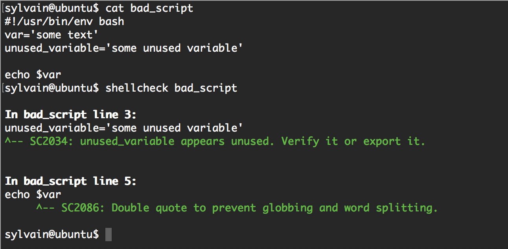
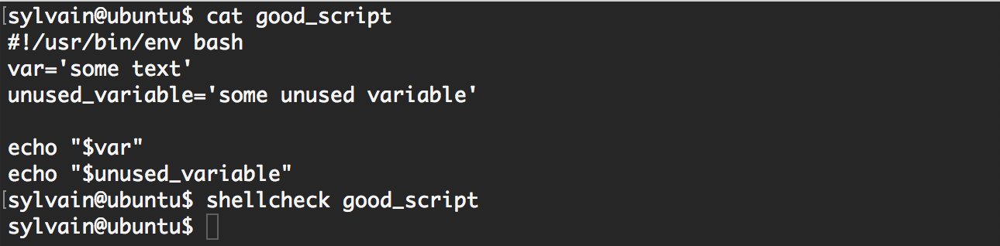

# 0x04. Loops, conditions and parsing
## Resources
- [Loops sample](https://tldp.org/LDP/Bash-Beginners-Guide/html/sect_09_01.html)
- [Variable assignment and arithmetic](https://tldp.org/LDP/abs/html/ops.html)
- [Comparison operators](https://tldp.org/LDP/abs/html/comparison-ops.html)
- [File test operators](https://tldp.org/LDP/abs/html/fto.html)
- [Make your scripts portable](https://www.cyberciti.biz/tips/finding-bash-perl-python-portably-using-env.html)

## Learning Objectives
<details>
<summary>How to create SSH keys</summary>

### Create SSH Keys
To create SSH keys, you'll use the ssh-keygen command, which is available by default on most Unix-like systems (Linux, macOS).
**1. Generate the SSH Key Pair:** Run the following command to generate a new SSH key pair:
```bash
ssh-keygen -t rsa -b 4096 -C "your_email@example.com"
```
- ``-t rsa``: Specifies the type of key to create, in this case, RSA.
- ``-b 4096``: Sets the key length to 4096 bits for added security.
- ``-C "your_email@example.com"``: Adds a label, usually your email, to help identify the key.
**2. Save the Key:** When prompted to “Enter a file in which to save the key,” press Enter to accept the default location (``~/.ssh/id_rsa``), or specify a different location if you prefer.

**3. Create a Passphrase (Optional):** You'll be prompted to enter a passphrase. You can enter one for extra security or leave it blank for no passphrase.

**4. Locate Your SSH Keys:** After this, you'll have two files:
- Public key: ``id_rsa.pub``
- Private key: ``id_rsa``

**5. Add Your SSH Key to the SSH Agent (Optional):** To manage your SSH keys, use the SSH agent:
```bash
eval "$(ssh-agent -s)"
ssh-add ~/.ssh/id_rsa
```

**7. Copy the Public Key to the Remote Server:** Use this command to copy the key to a remote server (e.g., GitHub, remote server):
```bash
cat ~/.ssh/id_rsa.pub
```
Copy the content, then paste it into the server's SSH key settings or ``.ssh/authorized_keys`` file on the remote server for authentication.

</details>
<details>
<summary>What is the advantage of using `#!/usr/bin/env bash` over `#!/bin/bash`</summary>

### using `#!/usr/bin/env bash`

Using ``#!/usr/bin/env bash`` instead of ``#!/bin/bash`` in a script has a key advantage: portability.
#### Portability Across Different Systems
- ``#!/usr/bin/env bash``:
    + This line tells the system to use the ``env`` command to locate ``bash`` in the user's ``PATH``. It’s particularly useful because the ``path`` to bash can vary depending on the operating system.
    + On most Linux systems, ``bash`` is located at ``/bin/bash``, but on other systems (like some *BSD systems or macOS), ``bash`` might be in a different location, such as ``/usr/local/bin/bash``
- ``#!/bin/bash``:
    + This directly specifies the path ``/bin/bash``, assuming that ``bash`` is located there. This works on most Linux systems, but it may fail on systems where ``bash`` is in a different location.
</details>
<details>
<summary>How to use `while`, `until` and `for` loops</summary>

### Loops in bash
#### 1. ``while`` Loop
A ``while`` loop executes as long as the specified condition remains true.
```bash
#!/bin/bash

counter=1
while [ $counter -le 5 ]; do
  echo "Counter is $counter"
  ((counter++))  # Increment the counter
done
```

#### 2. ``until`` Loop
An ``until`` loop is similar to ``while``, but it executes until the condition becomes true.
```bash
#!/bin/bash

counter=1
until [ $counter -gt 5 ]; do
  echo "Counter is $counter"
  ((counter++))
done
```
**Explanation:**
- ``until [ $counter -gt 5 ]``: The loop continues as long as ``counter`` is NOT greater than 5.
- This example has the same effect as the ``while`` loop above but stops when the condition becomes true.
#### 3. ``for`` Loop
A ``for`` loop iterates over a list of items.

**Example 1: Iterating Over a List of Values**
```bash
#!/bin/bash

for item in apple banana cherry; do
  echo "Fruit: $item"
done
```
**Explanation:**
- ``for item in apple banana cherry``: Loops over each item in the list.
- ``$item`` holds the current item in each iteration.

**Example 2: Using a Range of Numbers**
- Brace Expansion Loop:
```bash
#!/bin/bash

for i in {1..5}; do
  echo "Number: $i"
done
```
**Explanation:**
- ``{1..5}``: Specifies a range from 1 to 5.
- The loop runs once for each number in the range.

- **C-style Loop:**
```bash
#!/bin/bash

for ((i = 1; i <= 5; i++)); do
  echo "Number: $i"
done
```
**Example 3: Using ``seq`` to Define a Range with Steps**
```bash
#!/bin/bash

for i in $(seq 1 2 10); do
  echo "Step: $i"
done
```
**Explanation:**
- ``$(seq 1 2 10)``: Generates numbers from 1 to 10, in steps of 2.
- The loop iterates over these values (1, 3, 5, 7, 9).
#### Summary
- Use ``while`` to repeat actions while a condition is true.
- Use ``until`` to repeat actions until a condition becomes true.
- Use ``for`` to iterate over a list of values, including ranges or files in a directory.
</details>
<details>
<summary>The dollar sign ($) in Bash</summary>

### The dollar sign (``$``) in Bash
#### 1. Variable Access: ``$variable``
Use ``$`` to get the value of a variable.
```bash
name="Alice"
echo "Hello, $name"  # Outputs: Hello, Alice
```
#### 2. Command Substitution: ``$(command)``
``$(...)`` runs a command and substitutes it with the output.
```bash
current_time=$(date)
echo "Current time: $current_time"
```
#### 3. Positional Parameters: ``$1``, ``$2``, …, ``$n``
``$1``, ``$2``, etc., represent command-line arguments passed to a script.
```bash
# Script example.sh
echo "First argument: $1"

# Running: ./example.sh Hello
# Outputs: First argument: Hello
```
#### 4. Special Variables:
- ``$?``: The exit status of the last command.
```bash
ls /nonexistent_directory
echo $?  # Outputs: 1 (error code for "No such file or directory")
```
- ``$$``: The process ID of the current shell or script.
```bash
echo "Script PID: $$"
```
- ``$#``: The number of arguments passed to the script.
```bash
echo "Number of arguments: $#"
```
- ``$*`` and ``$@``: All arguments passed to the script.
    + ``$*`` treats all arguments as a single word.
    + ``$@`` treats each argument as a separate word.
```bash
echo "Arguments: $@"
```
#### 5. Arithmetic Expansion: ``$((expression))``
``$(( ... ))`` evaluates arithmetic expressions.
```bash
Copy code
a=5
b=3
echo $((a + b))  # Outputs: 8
```
#### 6. Parameter Expansion: ``${variable}``
Use ``${variable}`` when you need to refer to a variable with surrounding text, or when using advanced parameter expansion.
```bash
name="Alice"
echo "Hello, ${name}!"  # Outputs: Hello, Alice!

# Default value example
echo "${username:-Guest}"  # Outputs: Guest if username is unset or null
```
#### 7. Accessing Array Elements: ``${array[index]}``
``$`` is used to access specific elements in an array.
```bash
fruits=("apple" "banana" "cherry")
echo "${fruits[1]}"  # Outputs: banana
```
#### 8. Subshell Execution: ``(command)`` vs. ``$()``
``$()`` is preferred for command substitution, but ``(command)`` also runs commands in a subshell.
```bash
(echo "This runs in a subshell")
```
</details>
<details>
<summary>square brackets ([ ]) vs. double square brackets ([[ ]])</summary>

### square brackets for conditions
In Bash, conditions for if statements, while loops, and until loops typically need to be inside square brackets ([ ]) or double square brackets ([[ ]]). Also, **spaces around the condition** inside the brackets are required for the syntax to work correctly.

#### 1. Single Square Brackets: ``[ condition ]``
- Single brackets are commonly used for basic conditions.
- There **must be a space** after the opening bracket ``[`` and before the closing bracket ``]``.
```bash
num=10
if [ $num -gt 5 ]; then
  echo "Number is greater than 5"
fi
```

Without spaces, you’ll get a syntax error:
```bash
if [$num -gt 5]; then  # Incorrect
```
#### 2. Double Square Brackets: ``[[ condition ]]``
- Double brackets ``[[ ... ]]`` are often preferred for more complex conditions, as they support additional operators (e.g., pattern matching, regex).
- Spaces around the condition are also required inside double brackets.
```bash
if [[ $num -gt 5 && $num -lt 20 ]]; then
  echo "Number is between 5 and 20"
fi
```
#### 3. Negation with ``!``
You can negate conditions using ``!`` before the brackets, but you still need spaces.
```bash
if ! [ $num -lt 5 ]; then
  echo "Number is not less than 5"
fi
```
#### 4. Using Parentheses for Arithmetic Comparisons: ``(( expression ))``
- For arithmetic evaluations, you can use double parentheses ``(( ... ))`` without ``$`` for variables.
- Spaces are not strictly required here, but they improve readability.
```bash
if (( num > 5 )); then
  echo "Number is greater than 5"
fi
```
</details>
<details>
<summary>How to use `if`, `else`, `elif` and `case` condition statements</summary>

### how to use ``if``, ``else``, ``elif``, and ``case``
#### 1. ``if`` Statement
The ``if`` statement runs code only if a specified condition is true.
```bash
#!/bin/bash

num=10
if [ $num -gt 5 ]; then
  echo "Number is greater than 5"
fi
```
**Explanation:**
- ``if [ $num -gt 5 ]``: Checks if ``num`` is greater than 5.
- ``then``: Starts the code block that will run if the condition is true.
- ``fi``: Ends the if statement.
#### 2. ``if``-``else`` Statement
The ``if``-``else`` statement allows you to run one block of code if the condition is true and another if it’s false.
```bash
#!/bin/bash

num=3
if [ $num -gt 5 ]; then
  echo "Number is greater than 5"
else
  echo "Number is not greater than 5"
fi
```

#### 3. ``if``-``elif``-``else`` Statement
The ``if``-``elif``-``else`` structure allows multiple conditions to be checked in sequence.
```bash
#!/bin/bash

num=5
if [ $num -gt 5 ]; then
  echo "Number is greater than 5"
elif [ $num -eq 5 ]; then
  echo "Number is equal to 5"
else
  echo "Number is less than 5"
fi
```
#### 4. ``case`` Statement
The ``case`` statement is useful for checking multiple conditions that involve specific values or patterns. It’s especially helpful when you have many potential conditions to match.
```bash
#!/bin/bash

fruit="apple"
case $fruit in
  "apple")
    echo "I like apples!"
    ;;
  "banana")
    echo "I like bananas!"
    ;;
  "cherry" | "grape")
    echo "I like cherries and grapes!"
    ;;
  *)
    echo "I like other fruits!"
    ;;
esac
```
**Explanation:**
- ``case $fruit in``: Starts a case statement on the variable ``fruit``.
- Each case pattern (e.g., ``"apple"``, ``"banana"``, ``"cherry" | "grape"``) is followed by ``)`` and represents a possible match.
- ``;;`` ends each case block.
- ``*``: Acts as a "catch-all" for any values not matched by the previous cases.
- ``esac``: Ends the ``case`` statement.
</details>
<details>
<summary>How to use the `cut` command</summary>

### `cut` command
The ``cut`` command in Bash is a powerful utility for extracting sections from each line of input (usually from files or standard input). It can be used to cut based on character positions, byte positions, or fields, making it very versatile for processing text data. Here’s how to use it effectively:

**Basic Syntax** `cut OPTION... [FILE...]`
**Common Options**
- ``-f``: Select specific fields (columns) based on a delimiter.
- ``-d``: Specify the delimiter that separates fields (default is tab).
- ``-c``: Cut based on character position.
- ``-b``: Cut based on byte position.
- ``--complement``: Complement the selection (i.e., output everything except the specified fields).
#### Examples
**1. Cutting Fields by Delimiter**
If you have a file (``data.txt``) with comma-separated values:
```sql
name,age,city
Alice,30,New York
Bob,25,Los Angeles
Charlie,35,Chicago
```
Extract the second field (age):
```bash
cut -d ',' -f 2 data.txt
```
Output:
```
age
30
25
35
```
**2. Cutting Specific Characters**
If you want to cut specific characters from a file or a string:
- Extract the first three characters of each line:
    ```bash
    echo -e "Hello\nWorld\nBash" | cut -c 1-3
    ```
    *Output:*
    ```
    Hel
    Wor
    Bas
    ```
**3. Cutting by Byte Position**
You can also cut based on byte positions:
Extract the first 5 bytes:
```bash
echo "Hello, World!" | cut -b 1-5
```
*Output:*
```
Hello
```
**4. Combining Options**
You can combine options to get more specific results:
Extract the first and third fields from a colon-separated file:
```bash
echo "name:age:city" | cut -d ':' -f 1,3
```
*Output:* `name:city`
**5. Using --complement Option**
To output everything except the specified fields:
Output everything except the second field:
```bash
echo "name,age,city" | cut -d ',' --complement -f 2
```
*Output:* `name,city`

</details>
<details>
<summary>What are files and other comparison operators, and how to use them</summary>

### Comparison operators
#### File Comparison Operators
In Bash, file and other comparison operators are used to test conditions in scripts and command lines. These operators are essential for controlling the flow of execution in scripts, allowing you to check for the existence of files, compare strings, and perform numerical comparisons.

| Operator              | Description                                      |
|-----------------------|--------------------------------------------------|
| `-e FILE`             | True if the file exists.                        |
| `-f FILE`             | True if the file is a regular file.            |
| `-d FILE`             | True if the file is a directory.                |
| `-r FILE`             | True if the file is readable.                   |
| `-w FILE`             | True if the file is writable.                   |
| `-x FILE`             | True if the file is executable.                 |
| `-s FILE`             | True if the file exists and is not empty.      |
| `-L FILE`             | True if the file is a symbolic link.            |
| `-h FILE`             | True if the file is a symbolic link (same as `-L`). |
| `-nt FILE1 FILE2`     | True if FILE1 is newer than FILE2.              |
| `-ot FILE1 FILE2`     | True if FILE1 is older than FILE2.              |

##### Examples of File Comparison
```bash
#!/bin/bash

file="example.txt"

if [ -e "$file" ]; then
  echo "$file exists."
else
  echo "$file does not exist."
fi

if [ -d "$file" ]; then
  echo "$file is a directory."
elif [ -f "$file" ]; then
  echo "$file is a regular file."
else
  echo "$file is not a regular file or directory."
fi
```
#### String Comparison Operators

| Operator               | Description                                      |
|------------------------|--------------------------------------------------|
| `=`                    | True if the strings are equal.                  |
| `!=`                   | True if the strings are not equal.              |
| `<`                    | True if string1 is lexicographically less than string2 (only in `[[ ]]`). |
| `>`                    | True if string1 is lexicographically greater than string2 (only in `[[ ]]`). |
| `-z STRING`           | True if the string has zero length (is empty). |
| `-n STRING`           | True if the string has non-zero length.        |

##### Examples of String Comparison
```bash
#!/bin/bash

string1="hello"
string2="world"

if [ "$string1" = "$string2" ]; then
  echo "Strings are equal."
else
  echo "Strings are not equal."
fi

if [[ "$string1" < "$string2" ]]; then
  echo "$string1 is less than $string2."
fi
```
#### Numeric Comparison Operators

| Operator     | Description                                     |
|--------------|-------------------------------------------------|
| `-eq`        | True if numbers are equal.                     |
| `-ne`        | True if numbers are not equal.                 |
| `-lt`        | True if the left number is less than the right number. |
| `-le`        | True if the left number is less than or equal to the right number. |
| `-gt`        | True if the left number is greater than the right number. |
| `-ge`        | True if the left number is greater than or equal to the right number. |

##### Examples of Numeric Comparison
```bash
#!/bin/bash

num1=5
num2=10

if [ "$num1" -lt "$num2" ]; then
  echo "$num1 is less than $num2."
fi

if [ "$num1" -eq 5 ]; then
  echo "$num1 is equal to 5."
fi
```
#### Summary
- **File Operators:** Used to check the existence and properties of files and directories.
- **String Operators:** Used to compare strings for equality and other conditions.
- **Numeric Operators:** Used to compare integer values for equality and size.
</details>
<details>
<summary>what is awk and how to use it</summary>

### `awk`
``awk`` is a powerful text-processing tool and programming language in Unix/Linux systems that is used for pattern scanning and processing. It is particularly effective for working with structured data files, such as CSV or TSV, because it can easily handle field-based manipulation. ``awk`` allows you to perform various operations on text files, including searching, filtering, and formatting output.

**Basic Syntax** ``awk 'pattern { action }' file``
- ``pattern``: This is the condition that determines whether the action is executed. If omitted, the action is applied to all lines.
- ``action``: This is the code that is executed when the pattern matches.
#### Common Features
**1. Field Handling:** ``awk`` automatically splits each line into fields using a delimiter (by default, whitespace).
**2. Built-in Variables:** ``awk`` provides several built-in variables, such as:
- ``$0``: Represents the entire line.
- ``$1``, ``$2``, ..., ``$n``: Represents the first, second, ..., nth field.
- ``NF``: The number of fields in the current record.
- ``NR``: The number of records processed so far.
#### Examples of Using ``awk``
**1. Print Specific Fields**
If you have a file named ``data.txt``:
```text
Alice 30 Developer
Bob 25 Designer
Charlie 35 Manager
```
- Print the first field (name):
```bash
awk '{ print $1 }' data.txt
```
- *Output:*
```
Alice
Bob
Charlie
```
**2. Print Specific Fields with a Custom Delimiter**
If your file uses a comma as a delimiter, such as ``data.csv``:
```csv
Alice,30,Developer
Bob,25,Designer
Charlie,35,Manager
```
- Print the second field (age):
```bash
awk -F ',' '{ print $2 }' data.csv
```
- *Output:*
```
30
25
35
```
**3. Conditional Processing**
You can add conditions to process only certain lines:
- Print names of people older than 30:
```bash
awk '$2 > 30 { print $1 }' data.txt
```
- *Output:*
``Charlie``
**4. Counting Records**
You can use ``awk`` to count lines or fields:
- Count the number of lines:
```bash
awk 'END { print NR }' data.txt
```
- *Output:* `3`

**5. Using Built-in Variables**
You can use built-in variables like ``NF`` and ``NR``:
- Print the number of fields for each line:
```bash
awk '{ print NF }' data.txt
```
- *Output:*
```
3
3
3
```
**6. Formatting Output**
You can format the output using ``printf``:
- Formatted output:
```bash
awk '{ printf "Name: %-10s Age: %-3s\n", $1, $2 }' data.txt
```
*Output:*
```
Name: Alice      Age: 30 
Name: Bob        Age: 25 
Name: Charlie    Age: 35 
```
#### ``END`` block
In awk, the ``END`` block is a special block that is executed after all the input lines have been processed. It allows you to perform actions or calculations after you've read the entire input, which is particularly useful for summarizing data or outputting final results.
**How END Works**
- Placement: The ``END`` block comes after the main pattern-action blocks in an ``awk`` command.
- Execution: It is executed only once, after all the input data has been processed. If you have multiple ``END`` blocks, they are executed in the order they appear in the script.
- Common Use Cases: It is commonly used for printing summaries, totals, or any other data that needs to be displayed after processing the entire input.
**Example of Using END**
```bash
echo -e "Alice 90\nBob 85\nCharlie 88" | awk '{ total += $2 } END { print "Average score:", total/NR }'
```
Explanation:
- Input: The command feeds a list of names and scores into awk.
- Processing:
    + In the main block (``{ total += $2 }``), for each line, it adds the second field (the score) to the ``total`` variable.
- END Block: After processing all lines:
    + ``END { print "Average score:", total/NR }`` computes the average score by dividing the total by ``NR``, which is a built-in variable representing the number of records (lines) processed. It then prints the average.
*Output:* ``Average score: 87.6667``
#### Some commonly used built-in variables in awk

| Built-in Variable | Description                                           | Example                                      |
|-------------------|-------------------------------------------------------|----------------------------------------------|
| `$0`              | Represents the entire current input line              | `print $0`                                   |
| `$n`              | Represents the nth field in the current input line    | `print $1` (outputs the first field)        |
| `NR`              | Total number of input records read so far             | `print "Line number:", NR`                  |
| `NF`              | Number of fields in the current input line            | `print "Number of fields:", NF`             |
| `FNR`             | Record number in the current input file                | `print "Line number in current file:", FNR` |
| `FS`              | Input field separator (default: whitespace)           | `BEGIN { FS="," }`                           |
| `OFS`             | Output field separator (default: space)               | `BEGIN { OFS=" | " }`                        |
| `RS`              | Input record separator (default: newline)             | `BEGIN { RS=";" }`                           |
| `ORS`             | Output record separator (default: newline)            | `BEGIN { ORS=", " }`                         |
| `ARGC`            | Number of command-line arguments passed               | `print "Number of arguments:", ARGC`        |
| `ARGV`            | Array containing the command-line arguments           | `print "First argument:", ARGV[1]`          |

**Example Usage**
```bash
echo -e "Alice 90\nBob 85\nCharlie 88" | awk '{ print $1, "has score:", $2, "Total lines processed:", NR, "Fields in line:", NF }'
```
*Output:*
```
Alice has score: 90 Total lines processed: 1 Fields in line: 2
Bob has score: 85 Total lines processed: 2 Fields in line: 2
Charlie has score: 88 Total lines processed: 3 Fields in line: 2
```
#### Summary
``awk`` is a versatile tool for text processing and can be used for various tasks, including data extraction, reporting, and simple calculations. Here are some key points to remember:

- Field-Based: Works well with structured data.
- Pattern Matching: Allows for conditional processing based on patterns.
- Built-in Variables: Simplifies data manipulation.
- Scripting Capabilities: Supports complex operations through its programming language features.
</details>
<details>
<summary>What's an associative array</summary>

### Associative array
An associative array is a data structure that allows you to store data in key-value pairs. Unlike regular arrays, which use numerical indices, associative arrays use strings as keys. This makes it easy to retrieve, add, or manipulate values based on descriptive keys rather than numerical positions.
#### Key Features of Associative Arrays
**1. Key-Value Pairs:** Each entry in an associative array consists of a unique key and a corresponding value. You can think of it like a dictionary, where each word (key) maps to its definition (value).
**2. Dynamic Sizing:** Associative arrays can grow dynamically as you add new key-value pairs, so you don't need to specify the size in advance.
**3. Flexible Keys:** The keys can be any string, allowing you to use descriptive names that make your code more readable and understandable.

#### Example of Associative Arrays in Bash
In bash, associative arrays are declared and used with the following syntax:

- **Declaring an Associative Array**
```bash
declare -A my_array
```
- **Adding Key-Value Pairs**
```bash
my_array["key1"]="value1"
my_array["key2"]="value2"
```
- **Accessing Values**
```bash
echo "${my_array["key1"]}"  # Output: value1
```
- **Iterating Over an Associative Array**
```bash
for key in "${!my_array[@]}"; do
    echo "$key: ${my_array[$key]}"
done
```
Example Use Case
```bash
#!/bin/bash

declare -A fruits

# Adding fruit names and their colors
fruits["apple"]="red"
fruits["banana"]="yellow"
fruits["grape"]="purple"

# Printing out fruit colors
for fruit in "${!fruits[@]}"; do
    echo "$fruit is ${fruits[$fruit]}."
done
```
*Output:*
```plaintext
apple is red.
banana is yellow.
grape is purple.
```
#### Use of Associative Arrays in awk
In ``awk``, associative arrays are similar but can be used without explicit declaration. The keys can be any string, and you can access values in the same way:
```awk
awk '{ count[$1]++ } END { for (word in count) print word, count[word] }' input.txt
```
In this example, count[$1]++ counts occurrences of each unique value in the first field of the input file, using the values as keys in the associative array count.

Summary
Associative arrays are powerful tools for organizing and managing data in a more intuitive way, allowing for quick lookups and manipulations based on descriptive keys. They are widely used in scripting and programming for tasks that involve data aggregation and management.
</details>

## More Info
### Shellcheck
[Shellcheck](https://github.com/koalaman/shellcheck) is a tool that will help you write proper Bash scripts. It will make recommendations on your syntax and semantics and provide advice on edge cases that you might not have thought about. `Shellcheck` is your friend! All your Bash scripts must pass Shellcheck without any error or you will not get any points on the task.

`Shellcheck` is available on the school’s computers. If you want to use it on your own computer, here is how to [install it](https://github.com/koalaman/shellcheck#installing).
**Examples:**
- Not passing `Shellcheck`:


- Passing Shellcheck:



For every feedback, Shellcheck will provide a code that you can use to get more information about the issue, for example for code `SC2034`, you can browse [https://github.com/koalaman/shellcheck/wiki/SC2034](https://github.com/koalaman/shellcheck/wiki/SC2034).

## Tasks
### 0. Create a SSH RSA key pair
Read for this task:

[Linux and Mac OS users](https://github.com/koalaman/shellcheck/wiki/SC2034)
[Windows users](https://docs.rackspace.com/docs/generating-rsa-keys-with-ssh-puttygen)
man: `ssh-keygen`

You will soon have to manage your own **servers** concept page hosted on remote [data centers](https://www.youtube.com/watch?v=iuqXFC_qIvA&feature=youtu.be&t=46). We need to set them up with your RSA public key so that you can access them via SSH.
Create a RSA key pair.
Requirements:
- Share your **public key** in your answer file ``0-RSA_public_key.pub``
- Fill the ``SSH public key`` field of your intranet profile with the public key you just generated
- **Keep the private key to yourself in a secure location**, you will use it later to connect to your servers using SSH. Some storing ideas are Dropbox, Google Drive, password manager, USB key. Failing to do so will prevent you to access your servers, which will prevent you from doing your projects
- If you decide to add a passphrase to your key, make sure to save this passphrase in a secure location, you will not be able to use your keys without the passphrase

SSH and RSA keys will be covered in depth in a later project.

### 1. For Best School loop
Write a Bash script that displays ``Best School`` 10 times.
Requirement:
- You must use the `for` loop (`while` and `until` are forbidden)
```bash
$ head -n 2 1-for_best_school 
#!/usr/bin/env bash
# This script is displaying "Best School" 10 times
$ ./1-for_best_school 
Best School
Best School
Best School
Best School
Best School
Best School
Best School
Best School
Best School
Best School
```
Note that:
- The first line of my Bash script starts with ``#!/usr/bin/env bash``
- The second line of my Bash scripts is a comment explaining what it is doing

### 2. While Best School loop
Write a Bash script that displays ``Best School`` 10 times.
Requirements:
- You must use the ``while`` loop (``for`` and ``until`` are forbidden)
```bash
$ ./2-while_best_school
Best School
Best School
Best School
Best School
Best School
Best School
Best School
Best School
Best School
Best School
```
### 3. Until Best School loop
Write a Bash script that displays ``Best School`` 10 times.
Requirements:
- You must use the ``until`` loop (``for`` and ``while`` are forbidden)
```bash
$ ./3-until_best_school
Best School
Best School
Best School
Best School
Best School
Best School
Best School
Best School
Best School
Best School
```
### 4. If 9, say Hi!
Write a Bash script that displays ``Best School`` 10 times, but for the 9th iteration, displays ``Best School`` *and then* ``Hi`` on a new line.
Requirements:
- You must use the ``while`` loop (``for`` and ``until`` are forbidden)
- You must use the ``if`` statement
```bash
$ ./4-if_9_say_hi
Best School
Best School
Best School
Best School
Best School
Best School
Best School
Best School
Best School
Hi
Best School
```
### 5. 4 bad luck, 8 is your chance
Write a Bash script that loops from 1 to 10 and:
- displays ``bad luck`` for the 4th loop iteration
- displays ``good luck`` for the 8th loop iteration
- displays ``Best School`` for the other iterations
Requirements:
- You must use the ``while`` loop (``for`` and ``until`` are forbidden)
- You must use the ``if``, ``elif`` and ``else`` statements
```bash
$ ./5-4_bad_luck_8_is_your_chance
Best School
Best School
Best School
bad luck
Best School
Best School
Best School
good luck
Best School
Best School
```
### 6. Superstitious numbers
Write a Bash script that displays numbers from 1 to 20 and:
- displays ``4`` *and then* ``bad luck from China`` for the 4th loop iteration
- displays ``9`` *and then* ``bad luck from Japan`` for the 9th loop iteration
- displays ``17`` *and then* ``bad luck from Italy`` for the 17th loop iteration
Requirements:
- You must use the while loop (for and until are forbidden)
- You must use the case statement
```bash
$ ./6-superstitious_numbers
1
2
3
4
bad luck from China
5
6
7
8
9
bad luck from Japan
10
11
12
13
14
15
16
17
bad luck from Italy
18
19
20
```
### 7. Clock
Write a Bash script that displays the time for 12 hours and 59 minutes:
- display hours from 0 to 12
- display minutes from 1 to 59
Requirements:
- You must use the ``while`` loop (``for`` and ``until`` are forbidden)

Note that in this example, we only display the first 70 lines using the ``head`` command.
```bash
$ ./7-clock | head -n 70
Hour: 0
1
2
3
4
5
6
7
8
9
10
11
12
13
14
15
16
17
18
19
20
21
22
23
24
25
26
27
28
29
30
31
32
33
34
35
36
37
38
39
40
41
42
43
44
45
46
47
48
49
50
51
52
53
54
55
56
57
58
59
Hour: 1
1
2
3
4
5
6
7
8
9
```
### 8. For ls
Write a Bash script that displays:
- The content of the current directory
- In a list format
- Where only the part of the name after the first dash is displayed (refer to the example)
Requirements:
- You must use the ``for`` loop (``while`` and ``until`` are forbidden)
- Do not display hidden files
```bash
$ ls
100-read_and_cut              1-for_best_school         6-superstitious_numbers
101-tell_the_story_of_passwd  2-while_best_school       7-clock
102-lets_parse_apache_logs    3-until_best_school       8-for_ls
103-dig_the-data              4-if_9_say_hi                  9-to_file_or_not_to_file
10-fizzbuzz                   5-4_bad_luck_8_is_your_chance
$  ./8-for_ls
read_and_cut
tell_the_story_of_passwd
lets_parse_apache_logs
dig_the-data
fizzbuzz
for_best_school
while_best_school
until_best_school
if_9_say_hi
4_bad_luck_8_is_your_chance
superstitious_numbers
clock
for_ls
to_file_or_not_to_file
```
### 9. To file, or not to file
Write a Bash script that gives you information about the ``school`` file.
Requirements:
- You must use ``if`` and, ``else`` (``case`` is forbidden)
- Your Bash script should check if the file exists and print:
    + if the file exists: ``school file exists``
    + if the file does not exist: ``school file does not exist``
- If the file exists, print:
    + if the file is empty: ``school file is empty``
    + if the file is not empty: ``school file is not empty``
    + if the file is a regular file: ``school is a regular file``
    + if the file is not a regular file: (nothing)
```bash
$ file school
school: cannot open `school' (No such file or directory)
$ ./9-to_file_or_not_to_file 
school file does not exist
$ touch school
$ ./9-to_file_or_not_to_file 
school file exists
school file is empty
school is a regular file
$ echo 'betty' > school 
$ ./9-to_file_or_not_to_file 
school file exists
school file is not empty
school is a regular file
$ rm school 
$ mkdir school
$ ./9-to_file_or_not_to_file 
school file exists
school file is not empty
```
### 10. FizzBuzz
Write a Bash script that displays numbers from 1 to 100.
Requirements:
- Displays ``FizzBuzz`` when the number is a multiple of 3 and 5
- Displays ``Fizz`` when the number is multiple of 3
- Displays ``Buzz`` when the number is a multiple of 5
- Otherwise, displays the number
- In a list format
```bash
$ ./10-fizzbuzz | head -20
1
2
Fizz
4
Buzz
Fizz
7
8
Fizz
Buzz
11
Fizz
13
14
FizzBuzz
16
17
Fizz
19
Buzz
```
### 11. Read and cut
help: ``read``
Write a Bash script that displays the content of the file ``/etc/passwd``.
Your script should only display:
- username
- user id
- Home directory path for the user
Requirements:
- You must use the ``while`` loop (``for`` and ``until`` are forbidden)
```bash
$ cat /etc/passwd
root:x:0:0:root:/root:/bin/bash
daemon:x:1:1:daemon:/usr/sbin:/usr/sbin/nologin
bin:x:2:2:bin:/bin:/usr/sbin/nologin
sys:x:3:3:sys:/dev:/usr/sbin/nologin
sync:x:4:65534:sync:/bin:/bin/sync
games:x:5:60:games:/usr/games:/usr/sbin/nologin
man:x:6:12:man:/var/cache/man:/usr/sbin/nologin
lp:x:7:7:lp:/var/spool/lpd:/usr/sbin/nologin
mail:x:8:8:mail:/var/mail:/usr/sbin/nologin
news:x:9:9:news:/var/spool/news:/usr/sbin/nologin
uucp:x:10:10:uucp:/var/spool/uucp:/usr/sbin/nologin
proxy:x:13:13:proxy:/bin:/usr/sbin/nologin
www-data:x:33:33:www-data:/var/www:/usr/sbin/nologin
backup:x:34:34:backup:/var/backups:/usr/sbin/nologin
list:x:38:38:Mailing List Manager:/var/list:/usr/sbin/nologin
irc:x:39:39:ircd:/var/run/ircd:/usr/sbin/nologin
gnats:x:41:41:Gnats Bug-Reporting System (admin):/var/lib/gnats:/usr/sbin/nologin
nobody:x:65534:65534:nobody:/nonexistent:/usr/sbin/nologin
libuuid:x:100:101::/var/lib/libuuid:
syslog:x:101:104::/home/syslog:/bin/false
messagebus:x:102:106::/var/run/dbus:/bin/false
landscape:x:103:109::/var/lib/landscape:/bin/false
sshd:x:104:65534::/var/run/sshd:/usr/sbin/nologin
pollinate:x:105:1::/var/cache/pollinate:/bin/false
vagrant:x:1000:1000::/home/vagrant:/bin/bash
colord:x:106:112:colord colour management daemon,,,:/var/lib/colord:/bin/false
statd:x:107:65534::/var/lib/nfs:/bin/false
sylvain:98:99:Sylvain:/home/sylvain:/bin/bash
puppet:x:108:114:Puppet configuration management daemon,,,:/var/lib/puppet:/bin/false
ubuntu:x:1001:1001:Ubuntu:/home/ubuntu:/bin/bash
$ ./100-read_and_cut
root:0:/root
daemon:1:/usr/sbin
bin:2:/bin
sys:3:/dev
sync:4:/bin
games:5:/usr/games
man:6:/var/cache/man
lp:7:/var/spool/lpd
mail:8:/var/mail
news:9:/var/spool/news
uucp:10:/var/spool/uucp
proxy:13:/bin
www-data:33:/var/www
backup:34:/var/backups
list:38:/var/list
irc:39:/var/run/ircd
gnats:41:/var/lib/gnats
nobody:65534:/nonexistent
libuuid:100:/var/lib/libuuid
syslog:101:/home/syslog
messagebus:102:/var/run/dbus
landscape:103:/var/lib/landscape
sshd:104:/var/run/sshd
pollinate:105:/var/cache/pollinate
vagrant:1000:/home/vagrant
colord:106:/var/lib/colord
statd:107:/var/lib/nfs
sylvain:99:/bin/bash
puppet:108:/var/lib/puppet
ubuntu:1001:/home/ubuntu
```
### 12. Tell the story of passwd
Read:
- [IFS (internal field separator)](https://tldp.org/LDP/abs/html/internalvariables.html)
- [Understanding /etc/passwd](https://www.cyberciti.biz/faq/understanding-etcpasswd-file-format/)

The file ``/etc/passwd`` has already been covered in a previous project (0x02. Shell, I/O Redirections and filters) and you should be familiar with it. Today we will make up a story based on it.
Write a Bash script that displays the content of the file {{/etc/passwd}}, using the {{while}} loop + IFS.
Format: ``The user USERNAME is part of the GROUP_ID gang, lives in HOME_DIRECTORY and rides COMMAND/SHELL. USER ID's place is protected by the passcode PASSWORD, more info about the user here: USER ID INFO``
Requirements:
- You must use the ``while`` loop (``for`` and ``until`` are forbidden)
```bash
$ ./101-tell_the_story_of_passwd
The user root is part of the 0 gang, lives in /root and rides /bin/bash. 0's place is protected by the passcode x, more info about the user here: root
The user daemon is part of the 1 gang, lives in /usr/sbin and rides /usr/sbin/nologin. 1's place is protected by the passcode x, more info about the user here: daemon
The user bin is part of the 2 gang, lives in /bin and rides /usr/sbin/nologin. 2's place is protected by the passcode x, more info about the user here: bin
The user sys is part of the 3 gang, lives in /dev and rides /usr/sbin/nologin. 3's place is protected by the passcode x, more info about the user here: sys
The user sync is part of the 65534 gang, lives in /bin and rides /bin/sync. 4's place is protected by the passcode x, more info about the user here: sync
The user games is part of the 60 gang, lives in /usr/games and rides /usr/sbin/nologin. 5's place is protected by the passcode x, more info about the user here: games
The user man is part of the 12 gang, lives in /var/cache/man and rides /usr/sbin/nologin. 6's place is protected by the passcode x, more info about the user here: man
The user lp is part of the 7 gang, lives in /var/spool/lpd and rides /usr/sbin/nologin. 7's place is protected by the passcode x, more info about the user here: lp
The user mail is part of the 8 gang, lives in /var/mail and rides /usr/sbin/nologin. 8's place is protected by the passcode x, more info about the user here: mail
The user news is part of the 9 gang, lives in /var/spool/news and rides /usr/sbin/nologin. 9's place is protected by the passcode x, more info about the user here: news
The user uucp is part of the 10 gang, lives in /var/spool/uucp and rides /usr/sbin/nologin. 10's place is protected by the passcode x, more info about the user here: uucp
The user proxy is part of the 13 gang, lives in /bin and rides /usr/sbin/nologin. 13's place is protected by the passcode x, more info about the user here: proxy
The user www-data is part of the 33 gang, lives in /var/www and rides /usr/sbin/nologin. 33's place is protected by the passcode x, more info about the user here: www-data
The user backup is part of the 34 gang, lives in /var/backups and rides /usr/sbin/nologin. 34's place is protected by the passcode x, more info about the user here: backup
The user list is part of the 38 gang, lives in /var/list and rides /usr/sbin/nologin. 38's place is protected by the passcode x, more info about the user here: Mailing List Manager
The user irc is part of the 39 gang, lives in /var/run/ircd and rides /usr/sbin/nologin. 39's place is protected by the passcode x, more info about the user here: ircd
The user gnats is part of the 41 gang, lives in /var/lib/gnats and rides /usr/sbin/nologin. 41's place is protected by the passcode x, more info about the user here: Gnats Bug-Reporting System (admin)
The user nobody is part of the 65534 gang, lives in /nonexistent and rides /usr/sbin/nologin. 65534's place is protected by the passcode x, more info about the user here: nobody
The user libuuid is part of the 101 gang, lives in /var/lib/libuuid and rides . 100's place is protected by the passcode x, more info about the user here: 
The user syslog is part of the 104 gang, lives in /home/syslog and rides /bin/false. 101's place is protected by the passcode x, more info about the user here: 
The user messagebus is part of the 106 gang, lives in /var/run/dbus and rides /bin/false. 102's place is protected by the passcode x, more info about the user here: 
The user landscape is part of the 109 gang, lives in /var/lib/landscape and rides /bin/false. 103's place is protected by the passcode x, more info about the user here: 
The user sshd is part of the 65534 gang, lives in /var/run/sshd and rides /usr/sbin/nologin. 104's place is protected by the passcode x, more info about the user here: 
The user pollinate is part of the 1 gang, lives in /var/cache/pollinate and rides /bin/false. 105's place is protected by the passcode x, more info about the user here: 
The user vagrant is part of the 1000 gang, lives in /home/vagrant and rides /bin/bash. 1000's place is protected by the passcode x, more info about the user here: 
The user colord is part of the 112 gang, lives in /var/lib/colord and rides /bin/false. 106's place is protected by the passcode x, more info about the user here: colord colour management daemon,,,
The user statd is part of the 65534 gang, lives in /var/lib/nfs and rides /bin/false. 107's place is protected by the passcode x, more info about the user here: 
The user puppet is part of the 114 gang, lives in /var/lib/puppet and rides /bin/false. 108's place is protected by the passcode x, more info about the user here: Puppet configuration management daemon,,,
The user ubuntu is part of the 1001 gang, lives in /home/ubuntu and rides /bin/bash. 1001's place is protected by the passcode x, more info about the user here: Ubuntu
```
### 13. Let's parse Apache logs
[Apache](https://en.wikipedia.org/wiki/Apache_HTTP_Server) is among the most popular web servers in the world, serving 50% of all active websites, no doubt that you will have to interact with it within your career.

As a Full-Stack Software Engineer, you have to master the art of parsing log files. Today we will do a simple parsing of Apache log access files.

Today the Customer Support department reported that a user reported that the site is being “buggy”. Not being a detailed description, you want to have a look at the Apache logs and gather data about the traffic.
Write a Bash script that displays the visitor IP along with the [HTTP status code](https://en.wikipedia.org/wiki/List_of_HTTP_status_codes) from the Apache log file.

Requirement:
- Format: IP HTTP_CODE
    + in a list format
    + See example
- You must use ``awk``
- You are not allowed to use ``while``, ``for``, ``until`` and ``cut``
- Download and commit the [apache-access.log](https://intranet-projects-files.s3.amazonaws.com/holbertonschool-sysadmin_devops/80/apache-access.log) file along with your answers files
```bash
$ ./102-lets_parse_apache_logs | tail -n 10
185.130.5.207 301
185.130.5.207 301
91.224.140.223 200
62.210.142.23 304
92.222.20.166 304
180.76.15.19 200
2.1.201.36 304
198.58.99.82 304
50.116.30.23 304
209.133.111.211 200
```
### 14. Dig the data
Now that you’ve parsed the Apache log file, let’s sort the data so you can get a better idea of what is going on.
Using what you did in the previous exercise, write a Bash script that groups visitors by IP and HTTP status code, and displays this data.
Requirements:
- The exact format must be:
    + OCCURENCE_NUMBER IP HTTP_CODE
    + In list format
- Ordered from the greatest to the lowest number of occurrences
    + See example
- You must use ``awk``
- You are not allowed to use ``while``, ``for``, ``until`` and ``cut``
```bash
$ ./103-dig_the-data | head -n 10
    141 130.0.236.153 200
    140 62.210.250.66 200
    117 103.243.26.232 404
    67 195.154.172.143 200
    60 78.154.190.29 200
    45 195.154.172.59 200
    41 62.210.248.185 200
    41 167.114.156.198 200
    36 2.1.201.36 304
    36 195.154.172.53 200
```