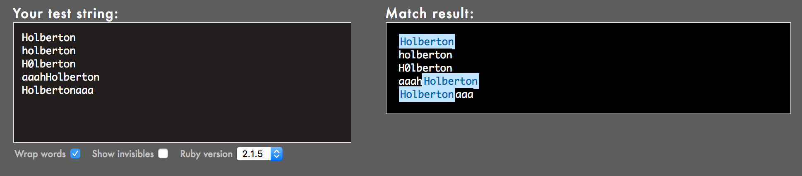
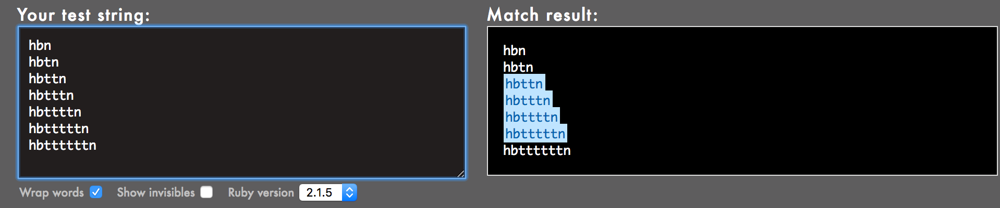
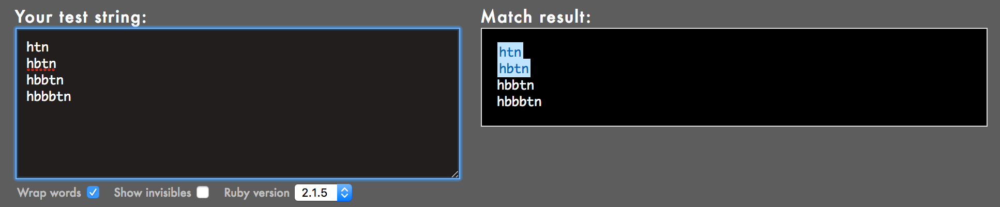
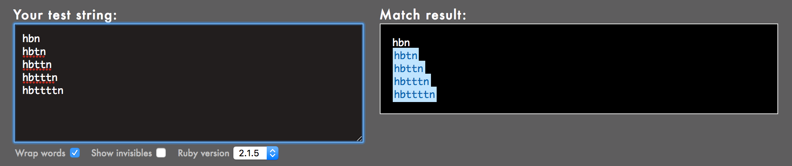
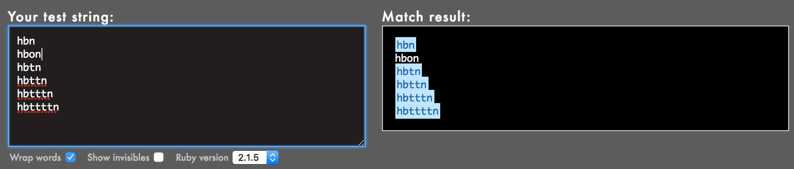

# 0x06. Regular expression
## Background Context
For this project, you have to build your regular expression using Oniguruma, a regular expression library that which is used by Ruby by default. Note that other regular expression libraries sometimes have different properties.

Because the focus of this exercise is to play with regular expressions (regex), here is the Ruby code that you should use, just replace the regexp part, meaning the code in between the ``//``:
```bash
$ cat example.rb
#!/usr/bin/env ruby
puts ARGV[0].scan(/127.0.0.[0-9]/).join
$
$ ./example.rb 127.0.0.2
127.0.0.2
$ ./example.rb 127.0.0.1
127.0.0.1
$ ./example.rb 127.0.0.a
```
## Resources
- [Regular expressions - basics](https://www.slideshare.net/slideshow/introducing-regular-expressions/63676155)
- [Regular expressions - advanced](https://www.slideshare.net/slideshow/advanced-regular-expressions-80296518/80296518)
- [Rubular is your best friend](https://rubular.com/)
- [Use a regular expression against a problem: now you have 2 problems](https://blog.codinghorror.com/regular-expressions-now-you-have-two-problems/)
- [Learn Regular Expressions with simple, interactive exercises](https://regexone.com/)

## Learning Objectifs
<details>
<summary>Basics of Ruby</summary>

### Why Use Ruby?
1. **Simplicity and Readability:** Ruby's syntax is straightforward and closely resembles English, making it easy for beginners to pick up and write clean code.
2. **Object-Oriented:** Ruby is a fully object-oriented language where everything is an object. Even numbers, strings, and methods are objects.
3. **Dynamic Typing:** Variables in Ruby don’t require type declarations, making coding faster and less restrictive.
4. **Powerful Libraries and Frameworks:** Ruby on Rails (or Rails), a web application framework built with Ruby, has made Ruby a popular choice for web development.
5. **Flexibility:** Ruby allows modification of its own code during runtime, giving developers flexibility to create custom behaviors.
6. **Community and Libraries:** Ruby has a strong community, extensive libraries, and gems (packages) for different functionalities, especially web development.

### Ruby Basics
Here's a quick look at some fundamental concepts:
**Installing Ruby on Linux**
- Update package lists:
```bash
sudo apt update
```
- Install Ruby:
```bash
sudo apt install ruby-full
```
- Verify the installation:
```bash
ruby -v
```
**Running Ruby Code**
1. Create a Ruby file: Create a file with the ``.rb`` extension, like ``example.rb``.
```ruby
# example.rb
puts "Hello, Ruby!"
```
2. Run the script: In your terminal, navigate to the directory where your Ruby file is located. Use the ``ruby`` command followed by the filename:
```bash
ruby example.rb
```
3. Output: You should see the output of the script in the terminal:
```
Hello, Ruby!
```
**Running Ruby Code Interactively (Optional)**
- If you just want to test Ruby code interactively, you can use the **IRB (Interactive Ruby)** console. Just type ``irb`` in your terminal and enter Ruby commands:
```bash
irb
```
- Then, you can type Ruby code directly:
- To exit IRB, type: `exit`

#### 1. Syntax and Variables
Ruby uses simple, readable syntax with minimal punctuation:
```ruby
# Hello, World in Ruby
puts "Hello, World" # prints text to the console

# Variables
name = "Alice"   # a string
age = 30         # an integer
height = 1.75    # a float
```
#### 2. Data Types
Ruby has several built-in data types, including:
- **String:** Text data (`"Hello, World"`)
- **Integer:** Whole numbers (`42`)
- **Float:** Decimal numbers (`3.14`)
- **Boolean:** `true` or `false`
- **Array:** Ordered list of items (`[1, 2, 3, "apple"]`)
- **Hash:** Key-value pairs (like a dictionary in Python): `{ "name" => "Alice", "age" => 30 }`

#### 3. Control Structures
Ruby has standard control structures like `if`, `else`, `unless`, `while`, and `for`.
```ruby
# If statement
if age > 18
  puts "You are an adult."
else
  puts "You are a minor."
end

# Loop
3.times do |i|
  puts "Looping iteration #{i}"
end
```
#### 4. Methods
Ruby methods are defined using the `def` keyword:
```ruby
def greet(name)
  "Hello, #{name}!"
end

puts greet("Alice")  # => "Hello, Alice!"
```
#### 5. Object-Oriented Programming (OOP)
Ruby is fully object-oriented. Classes are defined using the `class` keyword:
```ruby
class Person
  attr_accessor :name, :age  # creates getter and setter methods

  def initialize(name, age)
    @name = name  # instance variable
    @age = age
  end

  def introduce
    "Hi, I'm #{@name} and I'm #{@age} years old."
  end
end

person = Person.new("Alice", 30)
puts person.introduce  # => "Hi, I'm Alice and I'm 30 years old."
```
#### 6. Blocks, Procs, and Lambdas
Ruby allows passing blocks of code to methods, which can make the language more expressive.
```ruby
# Block
3.times { puts "Hello!" }

# Lambda
greet = ->(name) { "Hello, #{name}!" }
puts greet.call("Alice")
```
#### 7. Error Handling
Ruby uses `begin`, `rescue`, `ensure`, and `raise` keywords for error handling.
```ruby
begin
  result = 10 / 0
rescue ZeroDivisionError => e
  puts "Error: #{e.message}"
end
```
#### Key Libraries and Frameworks
- **Rails:** The Ruby on Rails framework is famous for creating complex web applications quickly and easily.
- **RSpec:** A testing library widely used in Ruby for Behavior-Driven Development (BDD).
- **Sinatra:** A lightweight web application library for building small, fast web applications.

#### When to Use Ruby
Ruby is particularly strong in:
- **Web Development:** With Ruby on Rails, you can quickly build web applications with solid frameworks and tools.
- **Scripting and Automation:** Ruby’s readability and flexibility make it ideal for scripts.
- **Rapid Prototyping:** Ruby’s syntax and libraries let developers build prototypes quickly.

</details>
<details>
<summary>Regular Expressions</summary>

### Regular Expressions
Regular expressions (regex) are patterns used to match character combinations in strings. They’re widely used in programming and text processing for searching, replacing, and validating string data. Here’s a quick rundown of the basics in regex:

#### 1. Literal Characters
Simply type characters to match exactly those characters.
Example: `cat` matches "cat" in the string "I have a cat."
#### 2. Metacharacters (special characters)
These are characters with special meanings:
- `.`: Matches any single character except a newline.
- `^`: Matches the beginning of a string.
- `$`: Matches the end of a string.
- `[]`: Matches any single character within the brackets.
- `|`: Acts as a logical OR.
Example: `c.t` matches "cat", "cut", etc.

#### 3. Character Classes
Define specific sets of characters to match.
- `[abc]`: Matches any one of "a", "b", or "c".
- `[^abc]`: Matches any character except "a", "b", or "c".
- `[a-z]`: Matches any lowercase letter from "a" to "z".
- `\d`: Matches any digit, equivalent to `[0-9]`.
- `\w`: Matches any word character (alphanumeric + underscore).
- `\s`: Matches any whitespace character.

#### 4. Quantifiers
Specify how many times to match a character or group:
- `*`: 0 or more times.
- `+`: 1 or more times.
- `?`: 0 or 1 time (optional).
- `{n}`: Exactly n times.
- `{n,}`: n or more times.
- `{n,m}`: Between n and m times.
Example: `a{2,4}` matches "aa", "aaa", or "aaaa".

#### 5. Grouping and Capturing
- `()` is used to group expressions and capture matching text.
- Example: `(ab)+` matches "ab", "abab", etc., capturing each "ab".

#### 6. Anchors
- `^`: Start of a string.
- `$`: End of a string.
- `\b`: Word boundary (e.g., `\bcat\b` matches "cat" as a standalone word).

#### 7. Escape Sequences
`\`: Escapes a special character (e.g., `\.` to match a literal period).
Examples of common escapes:
- \n: Newline
- \t: Tab

#### 8. Examples
```regex
\d{3}-\d{2}-\d{4}  # Matches a pattern like "123-45-6789" (Social Security Number format)
^[A-Za-z]+$         # Matches a line with only letters (uppercase or lowercase)
```
#### 9. Using Regular Expressions in Code
In most programming languages, you use a regex function or method to apply the expression, such as match(), search(), findall(), etc.

For example, in Python:
```python
import re

pattern = r'\d+'           # Matches one or more digits
text = "My age is 25"

matches = re.findall(pattern, text)
print(matches)             # Output: ['25']
```
</details>
<details>
<summary>Regular Expressions in Ruby</summary>

### Regular Expressions in Ruby

#### Pattern matching
- **``=~`` operator**: is used to check if a string matches a regular expression pattern. It returns the index (or position) of the first match if found, or nil if there’s no match.
```ruby
text = "The cat sat on the mat."

if text =~ /cat/
  puts "Found 'cat' at position #{text =~ /cat/}"
else
  puts "'cat' not found."
end
```
- **Comparison with `match`**
The main difference between `=~` and `.match` is in the return value:
- `=~` gives the index or nil.
- `.match` gives a `MatchData` object or `nil`.
You can use `=~` when you only need to check if the pattern exists or to get the starting index. For more detailed match information, use `.match`.
#### 1. Basic Matching
In Ruby, you can use `=~` to check if a string matches a pattern.
```ruby
pattern = /cat/
puts "I have a cat" =~ pattern  # Output: index 9 where "cat" starts
puts "I have a dog" =~ pattern  # Output: nil (no match)
```
#### 2. Metacharacters
```ruby
text = "The cat sat on the mat."

# . matches any single character
puts text =~ /c.t/       # Matches "cat" at index 4

# ^ and $ for start and end of string
puts text =~ /^The/      # Matches at the start (index 0)
puts text =~ /mat\.$/    # Matches "mat." at the end
```
**Explanation**
The pattern `/mat\.$/` is a regular expression that means:
- `mat`: Match the exact string "mat".
- `\.`: The backslash `\` escapes the dot `.`, so it matches a literal period (`.`). In regex, `.` alone would match any character, but `\.` specifically matches a period.
- `$`: The dollar sign anchors the match to the end of the string. This means "mat." must appear at the very end of the text.

#### 3. Character Classes
```ruby
# [aeiou] matches any vowel
puts "apple" =~ /[aeiou]/      # Matches the first vowel "a" at index 0

# \d matches any digit, \w matches any word character, \s matches whitespace
puts "Age: 25" =~ /\d+/        # Matches "25" at index 5
puts "Hello_world!" =~ /\w+/    # Matches "Hello" at index 0
```
#### 4. Quantifiers
```ruby
# * for 0 or more, + for 1 or more, ? for 0 or 1, {n} for exact count
puts "Hellooo" =~ /o+/         # Matches "ooo" at index 4
puts "abc" =~ /a{2,3}/         # No match (needs "aa" or "aaa")
puts "aabb" =~ /a?b+/          # Matches "ab" at index 1
```
#### 5. Grouping and Capturing
You can use parentheses `()` for grouping and capturing parts of a string.
```ruby
pattern = /(\w+)\s(\w+)/    # Capture two words separated by a space
text = "Hello World"
match_data = text.match(pattern)

if match_data
  puts match_data[0]         # Full match: "Hello World"
  puts match_data[1]         # First capture: "Hello"
  puts match_data[2]         # Second capture: "World"
end
```
Calling `match` on a string (like `text.match(pattern)`) applies a regular expression pattern to the string (`text`). If the pattern is found, `match` returns a `MatchData` object, which contains information about the match, including any captured groups. If there is no match, it returns `nil`.

**What MatchData Does**
If there’s a match, `match_data` will be a `MatchData` object with details about the match:
1. Accessing the matched string: `match_data[0]` (or simply` match_data.to_s`) gives the entire part of the string that matched the pattern.
2. Capturing groups: If the pattern has capturing groups (e.g., `/The (cat) sat on the (mat)\./`), `match_data[1]`, `match_data[2]`, etc., will provide the content of each group.
3. Position of the match: `match_data.begin(0)` and `match_data.end(0)` give the start and end positions of the match within the original string.
4. Access to named captures: If you use named captures in your regex (e.g., `/(?<animal>cat)/`), you can access them via `match_data[:animal]`.

#### 6. Anchors
```ruby
text = "It is a cat."

# \b matches a word boundary
puts text =~ /\bcat\b/       # Matches "cat" as a separate word

# ^ for start and $ for end
puts text =~ /^It/           # Matches at the start
puts text =~ /cat\.$/        # Matches "cat." at the end
```
#### 7. Replacing Text with `sub` and `gsub`
- `sub` replaces the first occurrence.
- `gsub` replaces all occurrences.
```ruby
text = "The cat sat on the cat mat."

# Replace the first occurrence of "cat" with "dog"
puts text.sub(/cat/, 'dog')     # Output: "The dog sat on the cat mat."

# Replace all occurrences of "cat" with "dog"
puts text.gsub(/cat/, 'dog')    # Output: "The dog sat on the dog mat."
```
#### 8. Case-Insensitive Matching
Add `i` after the pattern to ignore case.
```ruby
text = "I love RUBY!"
puts text =~ /ruby/i      # Matches "RUBY" at index 7, ignoring case
```
#### 9. Extracting All Matches with `scan`
```ruby
text = "The rain in Spain falls mainly in the plain."

# Finds all words ending with "ain"
puts text.scan(/\b\w*ain\b/)   # Output: ["rain", "Spain", "main", "plain"]
```
</details>
<details>
<summary>Ruby’s pattern-matching methods</summary>

### Ruby’s pattern-matching methods

| **Method**           | **Description**                                                                                          | **Example**                                                                                   | **Output**                        |
|----------------------|----------------------------------------------------------------------------------------------------------|-----------------------------------------------------------------------------------------------|-----------------------------------|
| `=~`                 | Returns the **index** of the first match or `nil` if no match is found.                                  | `"hello world" =~ /world/`                                                                    | `6`                               |
| `.match`             | Returns a **MatchData** object with details about the match, or `nil` if no match is found.              | `"hello world".match(/world/).to_s`                                                           | `"world"`                         |
| `.scan`              | Returns an array of **all matches** for the pattern.                                                     | `"hello hello".scan(/hello/)`                                                                 | `["hello", "hello"]`              |
| `.gsub`              | Replaces **all matches** with a specified replacement.                                                   | `"123-456".gsub(/\d/, "X")`                                                                   | `"XXX-XXX"`                       |
| `.sub`               | Replaces **only the first match** with a specified replacement.                                          | `"123-456".sub(/\d/, "X")`                                                                    | `"X23-456"`                       |
| `.include?`          | Checks if a **substring** exists within the string (does not use regex).                                 | `"hello world".include?("world")`                                                             | `true`                            |
| `.index`             | Returns the **index** of the first occurrence of a substring, or `nil` if not found.                     | `"hello world".index("world")`                                                                | `6`                               |
| `.start_with?`       | Checks if the string **starts with** the given substring.                                                | `"hello world".start_with?("hello")`                                                          | `true`                            |
| `.end_with?`         | Checks if the string **ends with** the given substring.                                                  | `"hello world".end_with?("world")`                                                            | `true`                            |
| `.match?` (Ruby 2.4+) | Returns `true` if a match is found; faster than `.match` when you only need a **boolean** result.       | `/world/.match?("hello world")`                                                               | `true`                            |

#### Usage Examples:
1. `=~`: When you only need the match index or to check if a match exists (returns `nil` if no match).
```ruby
"example text" =~ /text/       # => 8
"example text" =~ /absent/     # => nil
```
2. .match: When you need detailed match data, like matched groups or position.
```ruby
data = "hello world".match(/(\w+) (\w+)/)
puts data[1]                   # => "hello"
puts data[2]                   # => "world"
```
3. `.scan`: When you want all occurrences of a pattern.

```ruby
"cat bat mat".scan(/\w+at/)    # => ["cat", "bat", "mat"]
```
4. `.gsub` and `.sub`: For replacing patterns in a string globally or once.

```ruby
"123-456".gsub(/\d/, "X")      # => "XXX-XXX"
"123-456".sub(/\d/, "X")       # => "X23-456"
```
5. `.include?` and `.index`: For simple substring checks without regex.

```ruby
"hello world".include?("world")  # => true
"hello world".index("world")     # => 6
```
6. `.start_with?` and `.end_with?`: For checking if a string starts or ends with a specific substring.

```ruby
"hello world".start_with?("hello") # => true
"hello world".end_with?("world")   # => true
```
7. `.match?`: When you only need a boolean result from a regex check (available from Ruby 2.4).

```ruby
/world/.match?("hello world")     # => true
/absent/.match?("hello world")    # => false
```
</details>
<details>
<summary>Advanced regular expressions</summary>

### Advanced regular expressions
Advanced regular expressions involve concepts like **greedy vs lazy matching**, **lookahead and lookbehind**, and **backreferences**.

#### 1. Greedy vs. Lazy Matching
- **Greedy matching** tries to match as much text as possible.
- **Lazy matching** (also called **non-greedy matching**) tries to match as little text as possible.

**Example: Greedy vs Lazy Matching**
```ruby
text = "abc123ghi456ghi"
pattern_greedy = /abc.*ghi/
pattern_lazy = /abc.*?ghi/

puts text.match(pattern_greedy) # Greedy: Matches "abc123ghi456ghi"
puts text.match(pattern_lazy)  # Lazy: Matches "abc123ghi"
```
- **Greedy Match (`abc.*ghi`):** The `.*` pattern in the greedy match will try to consume as many characters as possible between `abc` and `ghi`, including everything between the first `ghi` and the second ghi. So, it matches the longest possible string: `"abc123ghi456ghi"`.
- **Lazy Match (`abc.*?ghi`):** The `.*?` pattern in the lazy match tries to match the shortest possible string between `abc` and `ghi`. It matches only the first `ghi` it encounters, so it matches `"abc123ghi"`.

#### 2. Lookahead Assertions
- **Lookahead** checks whether a string contains a pattern ahead of the current position, but doesn't consume the characters.
- **Positive Lookahead (`?=`):** Matches if the pattern is followed by another pattern.
- **Negative Lookahead (`?!`):** Matches if the pattern is not followed by another pattern.

**Example: Positive Lookahead**
```ruby
text = "apple 123 orange"
pattern = /apple(?=\s\d+)/

puts text.match(pattern) # Matches "apple" if followed by a space and digits
```
**Example: Negative Lookahead**
```ruby
text = "apple orange"
pattern = /apple(?!\sorange)/

puts text.match(pattern) # Matches "apple" if it is not followed by " orange"
```
#### 3. Lookbehind Assertions
- **Lookbehind** checks whether a string contains a pattern before the current position, but doesn't consume the characters.
- **Positive Lookbehind (`?<=`):** Matches if the pattern is preceded by another pattern.
- **Negative Lookbehind (`?<!`):** Matches if the pattern is not preceded by another pattern.

**Example: Positive Lookbehind**
```ruby
text = "I have 10 apples"
pattern = /(?<=have\s)\d+/

puts text.match(pattern) # Matches "10" only if preceded by "have "
```
**Example: Negative Lookbehind**
```ruby
text = "I have 10 apples"
pattern = /(?<!have\s)\d+/

puts text.match(pattern) # Matches "10" if it is not preceded by "have "
```
#### 4. Backreferences
- A **backreference** allows you to refer to a previously captured group in the same regular expression.
- Syntax: `\1`, `\2`, etc., referring to the first, second, etc., capture groups.

**Example: Backreferences**
```ruby
text = "abc123abc"
pattern = /(\w+)\d+(\w+)/

puts text.match(pattern).captures # ["abc", "abc"]

# Using backreference to match identical words
pattern_backref = /(\w+)\d+\1/
puts text.match(pattern_backref) # Matches "abc123abc"
```
#### 5. Non-capturing Groups
- A **non-capturing group** is used to group part of the expression without creating a capturing group (i.e., it doesn't save the matched part).
- Syntax: `(?:...)`

**Example: Non-capturing Group**
```ruby
text = "apple123orange456banana"
pattern = /(?:apple|orange)\d+/  # Matches apple or orange followed by digits

puts text.match(pattern) # Matches "apple123"
```
#### 6. Atomic Grouping
- **Atomic grouping** prevents backtracking once a match is found. This can improve performance by avoiding unnecessary attempts to match different parts of the regular expression.
- Syntax: `(?>...)`

**Example: Atomic Grouping**
```ruby
text = "abc123abc"
pattern = /(?>abc)\d+/ # Matches "abc" once and doesn't backtrack

puts text.match(pattern) # Matches "abc123"
```
#### 7. Unicode and Character Classes
- Regular expressions in Ruby support Unicode properties using `\p{}` for matching Unicode characters, which can be useful for matching letters or digits from specific languages or sets.
- `\p{L}` matches any letter, and `\p{N}` matches any number.

Example: Unicode Matching
```ruby
text = "你好 world"
pattern = /\p{L}+/

puts text.match(pattern) # Matches "你好"
```
#### 8. Modifiers
Modifiers change the behavior of regular expressions. Some common ones include:
- `i` - Case insensitive matching.
- `m` - Multiline mode (matches `^` and `$` across lines).
- `x` - Extended mode (allows whitespace and comments for better readability).

Example: Modifiers
```ruby
text = "Hello World"
pattern = /hello/i   # Case-insensitive match

puts text.match(pattern) # Matches "Hello"
```

</details>

## Tasks
### 0. Simply matching School


Requirements:
- The regular expression must match ``School``
- Using the project instructions, create a Ruby script that accepts one argument and pass it to a regular expression matching method
Example:
```bash
$ ./0-simply_match_school.rb School | cat -e
School$
$ ./0-simply_match_school.rb "Best School" | cat -e
School$
$ ./0-simply_match_school.rb "School Best School" | cat -e
SchoolSchool$
$ ./0-simply_match_school.rb "Grace Hopper" | cat -e
```
### 1. Repetition Token #0


Requirements:
- Find the regular expression that will match the above cases
- Using the project instructions, create a Ruby script that accepts one argument and pass it to a regular expression matching method

### 2. Repetition Token #1


Requirements:
- Find the regular expression that will match the above cases
- Using the project instructions, create a Ruby script that accepts one argument and pass it to a regular expression matching method

### 3. Repetition Token #2


Requirements:
- Find the regular expression that will match the above cases
- Using the project instructions, create a Ruby script that accepts one argument and pass it to a regular expression matching method

### 4. Repetition Token #3


Requirements:
- Find the regular expression that will match the above cases
- Using the project instructions, create a Ruby script that accepts one argument and pass it to a regular expression matching method
- Your regex should not contain square brackets

### 5. Not quite HBTN yet
Requirements:
- The regular expression must be exactly matching a string that starts with h ends with n and can have any single character in between
- Using the project instructions, create a Ruby script that accepts one argument and pass it to a regular expression matching method
Example:
```bash
$ ./5-beginning_and_end.rb 'hn' | cat -e
$
$ ./5-beginning_and_end.rb 'hbn' | cat -e
hbn$
$ ./5-beginning_and_end.rb 'hbtn' | cat -e
$
$ ./5-beginning_and_end.rb 'h8n' | cat -e
h8n$
$
```
### 6. Call me maybe
Requirement:
- The regular expression must match a 10 digit phone number
Example:
```bash
$ ./6-phone_number.rb 4155049898 | cat -e
4155049898$
$ ./6-phone_number.rb " 4155049898" | cat -e
$
$ ./6-phone_number.rb "415 504 9898" | cat -e
$
$ ./6-phone_number.rb "415-504-9898" | cat -e
$
```
### 7. OMG WHY ARE YOU SHOUTING?
Requirement:
- The regular expression must be only matching: capital letters
Example:
```bash
$ ./7-OMG_WHY_ARE_YOU_SHOUTING.rb "I realLy hOpe VancouvEr posseSs Yummy Soft vAnilla Dupper Mint Ice Nutella cream" | cat -e
ILOVESYSADMIN$
$ ./7-OMG_WHY_ARE_YOU_SHOUTING.rb "WHAT do you SAY?" | cat -e
WHATSAY$
$ ./7-OMG_WHY_ARE_YOU_SHOUTING.rb "cannot read you" | cat -e
$
```
### 8. Textme
This exercise was prepared for you by Guillaume Plessis, VP of Infrastructure at TextMe. It is something he uses daily. You can thank Guillaume for his project on Twitter.
For this task, you’ll be taking over Guillaume’s responsibilities: one afternoon, a TextMe VoIP Engineer comes to you and explains she wants to run some statistics on the TextMe app text messages transactions.

Requirements:
- Your script should output: ``[SENDER]``,``[RECEIVER]``,``[FLAGS]``
    + The sender phone number or name (including country code if present)
    + The receiver phone number or name (including country code if present)
    + The flags that were used
You can find a [log file here].

Example:
```bash
$ ./100-textme.rb 'Feb 1 11:00:00 ip-10-0-0-11 mdr: 2016-02-01 11:00:00 Receive SMS [SMSC:SYBASE1] [SVC:] [ACT:] [BINF:] [FID:] [from:Google] [to:+16474951758] [flags:-1:0:-1:0:-1] [msg:127:This planet has - or rather had - a problem, which was this: most of the people on it were unhappy for pretty much of the time.] [udh:0:]'
Google,+16474951758,-1:0:-1:0:-1
$
$
$ ./100-textme.rb 'Feb 1 11:00:00 ip-10-0-64-10 mdr: 2016-02-01 11:00:00 Receive SMS [SMSC:SYBASE2] [SVC:] [ACT:] [BINF:] [FID:] [from:+17272713208] [to:+19172319348] [flags:-1:0:-1:0:-1] [msg:136:Orbiting this at a distance of roughly ninety-two million miles is an utterly insignificant little blue green planet whose ape-descended] [udh:0:]'
+17272713208,+19172319348,-1:0:-1:0:-1
$
$ ./100-textme.rb 'Feb 1 11:00:00 ip-10-0-64-11 mdr: 2016-02-01 11:00:00 Sent SMS [SMSC:SYBASE1] [SVC:backendtextme] [ACT:] [BINF:] [FID:] [from:18572406905] [to:14022180266] [flags:-1:0:-1:-1:-1] [msg:136:Far out in the uncharted backwaters of the unfashionable end of the western spiral arm of the Galaxy lies a small unregarded yellow sun.] [udh:0:]'
18572406905,14022180266,-1:0:-1:-1:-1
$
$
$ ./100-textme.rb 'Feb 1 11:00:00 ip-10-0-64-11 mdr: 2016-02-01 11:00:00 Sent SMS [SMSC:SYBASE1] [SVC:backendtextme] [ACT:] [BINF:] [FID:] [from:12392190384] [to:19148265919] [flags:-1:0:-1:-1:-1] [msg:99:life forms are so amazingly primitive that they still think digital watches are a pretty neat idea.] [udh:0:]'
12392190384,19148265919,-1:0:-1:-1:-1
```