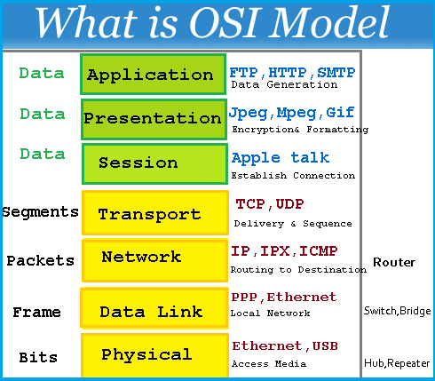
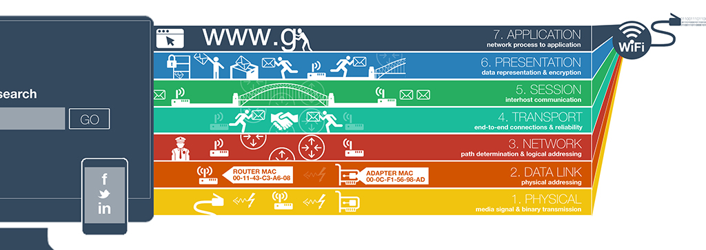
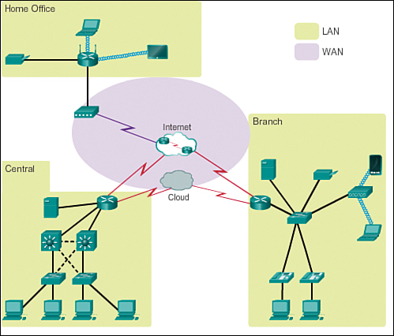
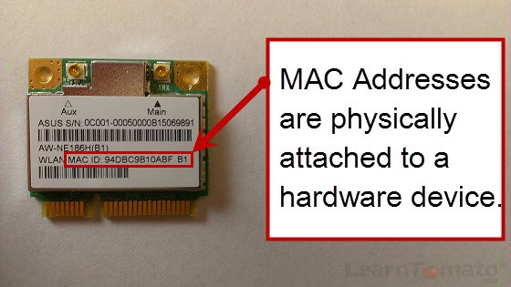
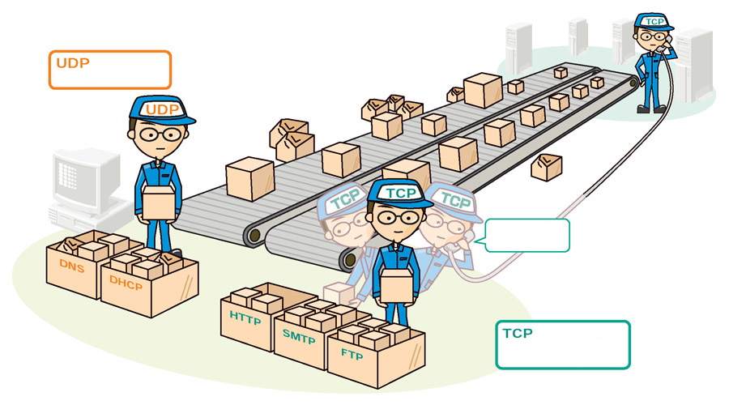

# 0x07. Networking basics #0
## Resources
- [OSI model](https://en.wikipedia.org/wiki/OSI_model)
- [Different types of network](https://www.lifewire.com/lans-wans-and-other-area-networks-817376)
- [LAN network](https://en.wikipedia.org/wiki/Local_area_network)
- [WAN network](https://en.wikipedia.org/wiki/Wide_area_network)
- [Internet](https://en.wikipedia.org/wiki/Internet)
- [MAC address](https://whatismyipaddress.com/mac-address)
- [What is an IP address](https://www.bleepingcomputer.com/tutorials/ip-addresses-explained/)
- [Private and public address](https://www.iplocation.net/public-vs-private-ip-address)
- [IPv4 and IPv6](https://www.webopedia.com/insights/ipv6-ipv4-difference/)
- [Localhost](https://en.wikipedia.org/wiki/Localhost)
- [TCP and UDP](https://www.howtogeek.com/190014/htg-explains-what-is-the-difference-between-tcp-and-udp/)
- [TCP/UDP ports List](https://en.wikipedia.org/wiki/List_of_TCP_and_UDP_port_numbers)
- [What is ping /ICMP](https://en.wikipedia.org/wiki/Ping_%28networking_utility%29)
- [Positional parameters](https://www.adminschoice.com/bash-positional-parameters)

## man or help:
- `netstat`
- `ping`

## Learning Objectives
<details>
<summary>OSI Model</summary>

### OSI Model
The OSI Model (Open Systems Interconnection Model) is a conceptual framework used to understand and implement network protocols in seven layers. Developed by the International Organization for Standardization (ISO), the OSI model breaks down the complex process of network communication into manageable parts, with each layer having a specific role.

#### The Seven Layers of the OSI Model
1. **Physical Layer (Layer 1):**
- Handles the physical connection between devices.
- Deals with raw data transmission, including electrical signals, cables, switches, and the physical aspects of the network.
- Examples: Ethernet cables, hubs, repeaters.

2. **Data Link Layer (Layer 2):**
- Establishes, maintains, and decides how data is transferred over the physical layer to the next layer.
- Manages physical addressing (MAC addresses) and error detection and correction.
- Examples: Ethernet, switches, MAC (Media Access Control) addresses.

3. **Network Layer (Layer 3):**
- Responsible for logical addressing, routing, and packet forwarding between different networks.
- Uses IP addresses to determine the best path for data to travel.
- Examples: IP (Internet Protocol), routers.

4. **Transport Layer (Layer 4):**
- Manages end-to-end communication, including data segmentation, flow control, and error recovery.
- Ensures complete data transfer, and determines whether to use TCP (reliable) or UDP (unreliable).
- Examples: TCP (Transmission Control Protocol), UDP (User Datagram Protocol).

5. **Session Layer (Layer 5):**
- Establishes, manages, and terminates sessions between applications on different devices.
- Keeps track of data being sent so that it can resume from the correct point if interrupted.
- Examples: Session establishment protocols, NetBIOS.

6. **Presentation Layer (Layer 6):**
- Translates data between the application layer and the network format.
- Handles data encoding, encryption, and compression to ensure data is in a usable format.
- Examples: SSL (Secure Sockets Layer), JPEG, GIF.

7. **Application Layer (Layer 7):**
- Closest to the end user, interacting directly with software applications.
- Manages application-specific functions and enables network services, like file transfers, email, and web browsing.
- Examples: HTTP, FTP, SMTP.

#### Key Concepts of the OSI Model
- **Encapsulation:** Each layer packages data and adds its own header, which helps in managing the data as it travels from the application layer down to the physical layer.
- **Decapsulation:** When data reaches the destination, each layer removes the respective header added during encapsulation, making the data usable for the receiving application.
- **Interoperability:** Since each layer is designed to operate independently, different technologies and protocols can be used within the same network by interacting through clearly defined interfaces.

#### Purpose and Benefits of the OSI Model
The OSI Model provides a standardized approach to understanding network interactions, which helps in troubleshooting, designing networks, and promoting interoperability between different systems.
</details>
<details>
<summary>What is a LAN</summary>

### LAN (Local Area Network)
A Local Area Network (LAN) is a network that connects computers and devices within a limited area, such as a home, office, or campus.

#### Typical Usage
- **Resource Sharing:** Allows connected devices to share resources like files, printers, and internet access.
- **Communication:** Facilitates communication among users via messaging and file transfers within the network.
- **Centralized Data Management:** Provides a central database for easy access and management of files and applications.
- **Efficient Data Transfer:** Offers high data transfer speeds within a limited range, making it ideal for environments needing quick, local access.
#### Typical Geographical Size
- **Geographic Range:** Typically spans a small geographic area, such as:
    + A single room
    + A building
    + A group of nearby buildings (e.g., a campus or office complex)
- **Range Limit:** Generally covers up to a few hundred meters, though most LANs are within a range of a few rooms or floors of a building.
</details>
<details>
<summary>What is a WAN</summary>

### What is a WAN
A Wide Area Network (WAN) is a telecommunications network that connects computers and smaller networks (like LANs) across a broad geographic area. Unlike LANs, WANs are often public or semi-public, connecting multiple locations across cities, countries, or even continents.

#### Typical Usage
- **Business Connectivity:** Allows businesses with multiple office locations to connect their sites and centralize data management, applications, and resources.
- **Internet Backbone:** The internet itself is a type of WAN, connecting networks globally.
- **Remote Access:** Enables remote offices, branches, and employees to access company resources securely.
- **Communication:** Supports communication and data sharing across vast distances, facilitating video conferencing, email, and file sharing among distant sites.
#### Typical Geographical Size
- **Geographic Range:** Covers large areas, ranging from regional (e.g., a city or state) to global scales.
- **Range Limit:** Unlike LANs, WANs can extend across thousands of miles, connecting devices and networks over entire countries, continents, and even globally.

WANs typically rely on leased telecommunications lines (e.g., fiber optic, satellite, or public internet connections) to connect dispersed locations, which makes them more complex and costly to maintain than LANs.
</details>
<details>
<summary>What is the Internet</summary>

### What is the Internet

The Internet is a global network of interconnected computers and networks, enabling devices worldwide to communicate, share information, and access services. It connects millions of private, public, academic, business, and government networks through a common set of protocols, primarily TCP/IP (Transmission Control Protocol/Internet Protocol). It provides the foundation for many essential services, such as the World Wide Web, email, and file sharing.

#### What is an IP Address?
An IP (Internet Protocol) address is a unique numerical label assigned to each device on a network. It identifies devices, enabling them to communicate with each other over the internet. The IP address provides two main pieces of information:
- **Network Identification:** Identifies the network the device is part of.
- **Host Identification:** Specifies the unique device within that network.

#### What Are the Two Types of IP Addresses?
1. **IPv4 (Internet Protocol version 4):**
- Uses a 32-bit address, represented as four numbers separated by dots (e.g., `192.168.0.1`).
- Has approximately 4.3 billion unique addresses, which is insufficient for the growing number of devices on the internet.
2. **IPv6 (Internet Protocol version 6):**
- Uses a 128-bit address, represented as eight groups of hexadecimal numbers separated by colons (e.g., `2001:0db8:85a3:0000:0000:8a2e:0370:7334`).
- Provides an almost unlimited number of unique addresses, solving IPv4’s address exhaustion problem.

#### What is Localhost?
Localhost refers to the device you’re currently using and is commonly assigned the IP address `127.0.0.1` (for IPv4) or `::1` (for IPv6). It is used for testing and development purposes, enabling software to communicate within the same device without connecting to an external network.

**Uses:** Developers use localhost to test applications locally before deploying them to external servers. It allows services to interact with each other on the same machine without requiring network connectivity.

#### What is a Subnet?
A subnet (subnetwork) is a smaller network segment within a larger IP network, used to organize and optimize traffic. Subnets divide a larger network into more manageable parts, allowing for improved performance, security, and IP address allocation.
**Subnet Mask:** A subnet mask (e.g., `255.255.255.0` in IPv4) defines which portion of the IP address represents the network and which part represents the host. Devices within the same subnet communicate directly, while communication across subnets requires a router.

#### Why Was IPv6 Created?
IPv6 was created to address the IPv4 address exhaustion problem. The rapid growth of the internet and the proliferation of devices (computers, smartphones, IoT devices) outpaced IPv4’s capacity of approximately 4.3 billion unique addresses. Key reasons for IPv6’s creation include:
- **Expanding Address Space:** IPv6’s 128-bit addressing system provides over 340 undecillion (3.4 x 10^38) unique IP addresses, accommodating the increasing number of devices.
- **Enhanced Efficiency:** IPv6 introduces simplified packet headers and improved routing efficiency.
- **Built-In Security:** IPv6 was designed with mandatory IPsec (Internet Protocol Security), providing end-to-end encryption and authentication.
- **Better Support for Modern Internet Needs:** IPv6 supports modern internet requirements like auto-configuration, better mobility features, and multicast addressing.

IPv6 adoption ensures the continued growth and scalability of the internet, meeting the demands of an ever-expanding, interconnected world.
</details>
<details>
<summary>TCP/UDP</summary>

### TCP/UDP
TCP (Transmission Control Protocol) and UDP (User Datagram Protocol) are the two main data transfer protocols used with IP at the Transport Layer (Layer 4) of the OSI Model. They handle how data is transferred between devices on a network.

#### What Are the 2 Mainly Used Data Transfer Protocols for IP?
1. **TCP (Transmission Control Protocol):** Provides a reliable, connection-oriented communication channel that ensures data packets are sent and received in order. Commonly used for applications where data integrity is crucial (e.g., web browsing, email, file transfer).
2. **UDP (User Datagram Protocol):** Provides a faster, connectionless communication channel without guarantee of delivery or order. It’s used for applications needing speed and efficiency over reliability (e.g., video streaming, online gaming, VoIP).

#### What is the Main Difference Between TCP and UDP?
The main difference is in **connection** and **reliability**:
- **TCP**: Connection-oriented, meaning it establishes a connection before data transfer. It ensures reliable delivery with error-checking, packet sequencing, and retransmission of lost packets. This makes TCP slower but reliable.
- **UDP**: Connectionless, meaning it sends packets without establishing a connection. It does not guarantee packet delivery, order, or error correction, resulting in faster but less reliable transmission. UDP is preferred for applications that prioritize speed.

#### What is a Port?
A port is a numerical identifier in the TCP/UDP headers that directs data to specific applications or processes on a device. It acts as a virtual "door" that network services use to identify where data should be sent or received.

Port Numbers: Each port is associated with specific applications or services. For example, SSH, HTTP, and HTTPS each have unique port numbers.
#### SSH, HTTP, and HTTPS Port Numbers:
- SSH (Secure Shell): Port 22
- HTTP (Hypertext Transfer Protocol): Port 80
- HTTPS (Hypertext Transfer Protocol Secure): Port 443

#### What Tool/Protocol is Often Used to Check if a Device is Connected to a Network?
The **ping** tool (using the **ICMP** protocol, Internet Control Message Protocol) is commonly used to check if a device is reachable on a network. It sends ICMP echo requests to the target device, and if the device is connected and reachable, it will respond with ICMP echo replies.
</details>

## Tasks
### 0. OSI model
OSI (Open Systems Interconnection) is an abstract model to describe layered communication and computer network design. The idea is to segregate the different parts of what make communication possible.

It is organized from the lowest level to the highest level:
- The lowest level: layer 1 which is for transmission on physical layers with electrical impulse, light or radio signal
- The highest level: layer 7 which is for application specific communication like SNMP for emails, HTTP for your web browser, etc
Keep in mind that the OSI model is a concept, it’s not even tangible. The OSI model doesn’t perform any functions in the networking process. It is a conceptual framework so we can better understand complex interactions that are happening. Most of the functionality in the OSI model exists in all communications systems.


In this project we will mainly focus on:
- The Transport layer and especially TCP/UDP
- On the Network layer with IP and ICMP
The image bellow describes more concretely how you can relate to every level.


Questions:
What is the OSI model?
1. Set of specifications that network hardware manufacturers must respect
2. The OSI model is a conceptual model that characterizes the communication functions of a telecommunication system without regard to their underlying internal structure and technology
3. The OSI model is a model that characterizes the communication functions of a telecommunication system with a strong regard for their underlying internal structure and technology

How is the OSI model organized?
1. Alphabetically
2. From the lowest to the highest level
3. Randomly

### 1. Types of network


LAN connect local devices together, WAN connects LANs together, and WANs are operating over the Internet.

Questions:
What type of network a computer in local is connected to?
1. Internet
2. WAN
3. LAN

What type of network could connect an office in one building to another office in a building a few streets away?
1. Internet
2. WAN
3. LAN

What network do you use when you browse www.google.com from your smartphone (not connected to the Wifi)?
1. Internet
2. WAN
3. LAN

### 2. MAC and IP address


Questions:

What is a MAC address?
1. The name of a network interface
2. The unique identifier of a network interface
3. A network interface

What is an IP address?
1. Is to devices connected to a network what postal address is to houses
2. The unique identifier of a network interface
3. Is a number that network devices use to connect to networks

### 3. UDP and TCP


Let’s fill the empty parts in the drawing above.

Questions:

- Which statement is correct for the TCP box:
    + `It is a protocol that is transferring data in a slow way but surely`
    + `It is a protocol that is transferring data in a fast way and might loss data along in the process`
- Which statement is correct for the UDP box:
    + `It is a protocol that is transferring data in a slow way but surely`
    + `It is a protocol that is transferring data in a fast way and might loss data along in the process`
- Which statement is correct for the TCP worker:
    + `Have you received boxes x, y, z?`
    + `May I increase the rate at which I am sending you boxes?`

### 4. TCP and UDP ports
Once packets have been sent to the right network device using IP using either UDP or TCP as a mode of transportation, it needs to actually enter the network device.

If we continue the comparison of a network device to your house, where IP address is like your postal address, UDP and TCP ports are like the windows and doors of your place. A TCP/UDP network device has 65535 ports. Some of them are officially reserved for a specific usage, some of them are known to be used for a specific usage (but nothing is officially declared) and the rest are free of use.

While the full list of ports should not be memorized, it is important to know the most used ports, let’s start by remembering 3 of them:
- **22** for SSH
- **80** for HTTP
- **443** for HTTPS
Note that a specific [IP + port = socket](https://stackoverflow.com/questions/152457/what-is-the-difference-between-a-port-and-a-socket).

Write a Bash script that displays listening ports:
- That only shows listening sockets
- That shows the PID and name of the program to which each socket belongs

Example:
```bash
sylvain@ubuntu$ sudo ./4-TCP_and_UDP_ports
Active Internet connections (only servers)
Proto Recv-Q Send-Q Local Address           Foreign Address         State       PID/Program name
tcp        0      0 *:sunrpc                *:*                     LISTEN      518/rpcbind
tcp        0      0 *:ssh                   *:*                     LISTEN      1240/sshd
tcp        0      0 *:32938                 *:*                     LISTEN      547/rpc.statd
tcp6       0      0 [::]:sunrpc             [::]:*                  LISTEN      518/rpcbind
tcp6       0      0 [::]:ssh                [::]:*                  LISTEN      1240/sshd
tcp6       0      0 [::]:33737              [::]:*                  LISTEN      547/rpc.statd
udp        0      0 *:sunrpc                *:*                                 518/rpcbind
udp        0      0 *:691                   *:*                                 518/rpcbind
udp        0      0 localhost:723           *:*                                 547/rpc.statd
udp        0      0 *:60129                 *:*                                 547/rpc.statd
udp        0      0 *:3845                  *:*                                 562/dhclient
udp        0      0 *:bootpc                *:*                                 562/dhclient
udp6       0      0 [::]:47444              [::]:*                              547/rpc.statd
udp6       0      0 [::]:sunrpc             [::]:*                              518/rpcbind
udp6       0      0 [::]:50038              [::]:*                              562/dhclient
udp6       0      0 [::]:691                [::]:*                              518/rpcbind
Active UNIX domain sockets (only servers)
Proto RefCnt Flags       Type       State         I-Node   PID/Program name    Path
unix  2      [ ACC ]     STREAM     LISTENING     7724     518/rpcbind         /run/rpcbind.sock
unix  2      [ ACC ]     STREAM     LISTENING     6525     1/init              @/com/ubuntu/upstart
unix  2      [ ACC ]     STREAM     LISTENING     8559     835/dbus-daemon     /var/run/dbus/system_bus_socket
unix  2      [ ACC ]     STREAM     LISTENING     9190     1087/acpid          /var/run/acpid.socket
unix  2      [ ACC ]     SEQPACKET  LISTENING     7156     378/systemd-udevd   /run/udev/control
```
### 5. Is the host on the network
The Internet Control Message Protocol (ICMP) is a protocol in the Internet protocol suite. It is used by network devices, to check if other network devices are available on the network. The command `ping` uses ICMP to make sure that a network device remains online or to troubleshoot issues on the network.

Write a Bash script that pings an IP address passed as an argument.

Requirements:
- Accepts a string as an argument
- Displays `Usage: 5-is_the_host_on_the_network {IP_ADDRESS}` if no argument passed
- Ping the IP 5 times

Example:
```bash
sylvain@ubuntu$ ./5-is_the_host_on_the_network 8.8.8.8
PING 8.8.8.8 (8.8.8.8) 56(84) bytes of data.
64 bytes from 8.8.8.8: icmp_seq=1 ttl=63 time=12.9 ms
64 bytes from 8.8.8.8: icmp_seq=2 ttl=63 time=13.6 ms
64 bytes from 8.8.8.8: icmp_seq=3 ttl=63 time=7.83 ms
64 bytes from 8.8.8.8: icmp_seq=4 ttl=63 time=11.3 ms
64 bytes from 8.8.8.8: icmp_seq=5 ttl=63 time=7.57 ms

--- 8.8.8.8 ping statistics ---
5 packets transmitted, 5 received, 0% packet loss, time 4006ms
rtt min/avg/max/mdev = 7.570/10.682/13.679/2.546 ms
sylvain@ubuntu$
sylvain@ubuntu$ ./5-is_the_host_on_the_network
Usage: 5-is_the_host_on_the_network {IP_ADDRESS}
```
It is interesting to look at the `time` value, which is the time that it took for the ICMP request to go to the `8.8.8.8` IP and come back to my host. The IP `8.8.8.8` is owned by Google, and the quickest roundtrip between my computer and Google was 7.57 ms which is pretty fast, which is a sign that the network path between my computer and Google’s datacenter is in good shape. A slow `ping` would indicate a slow network.

Next time you feel that your connection is slow, try the `ping` command to see what is going on!